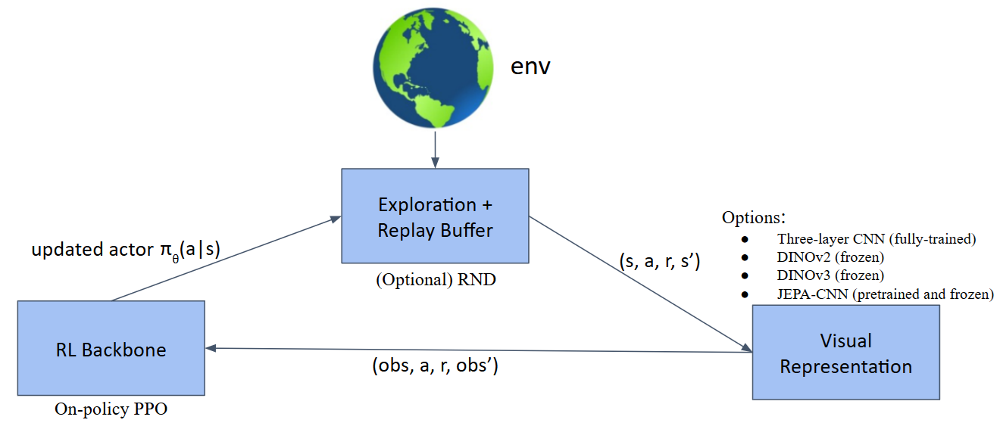
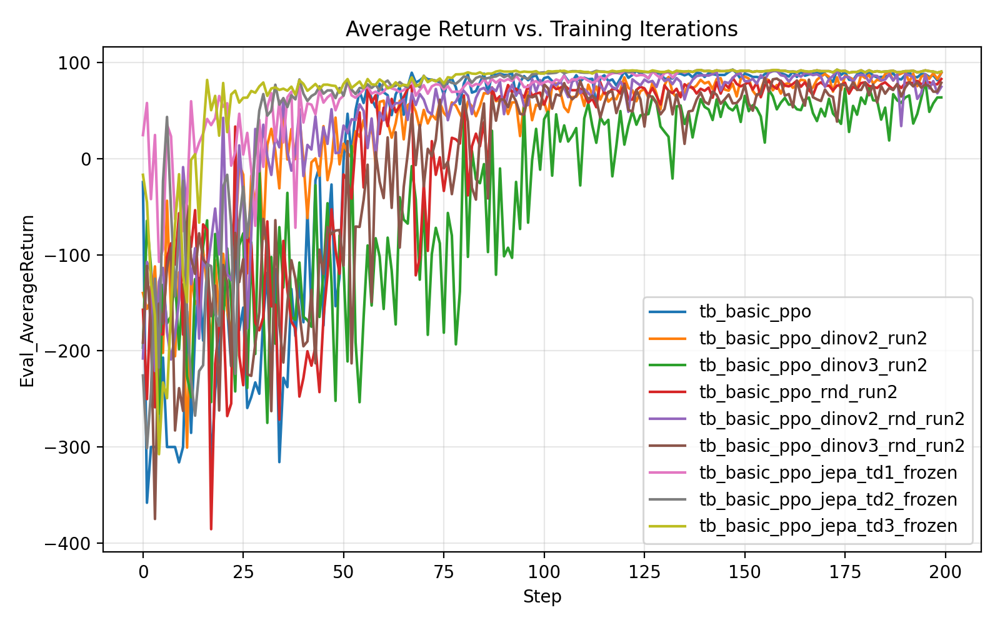
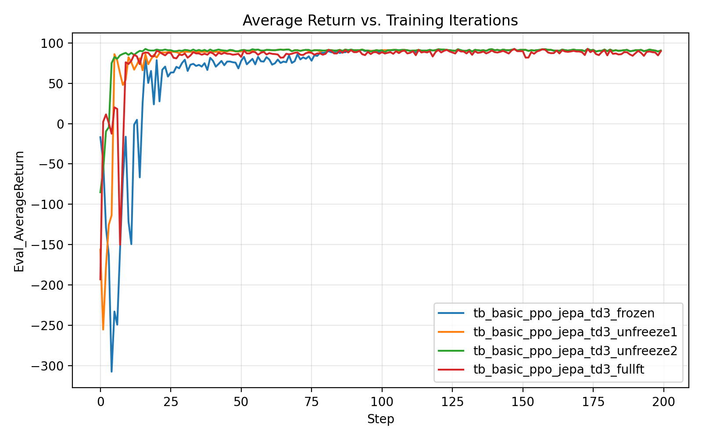
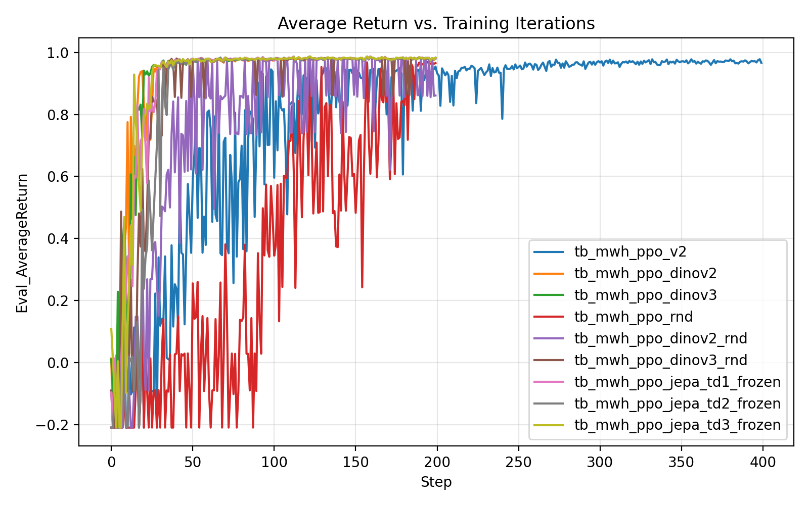
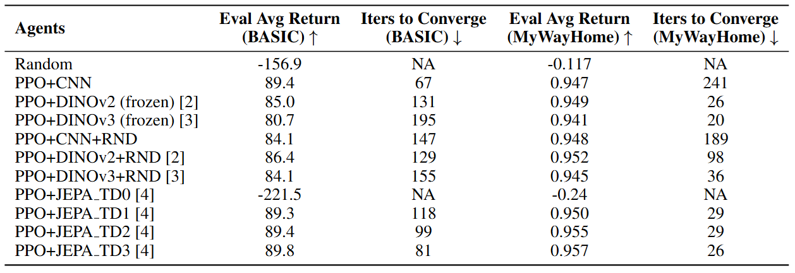
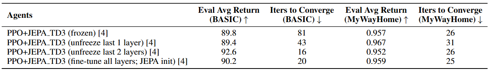
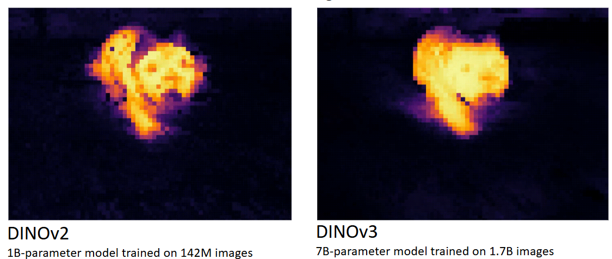
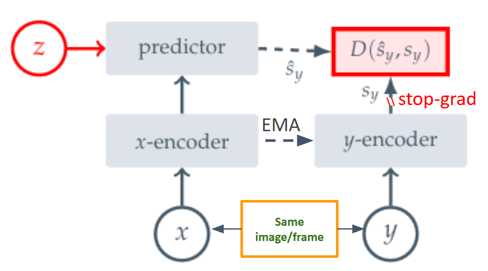
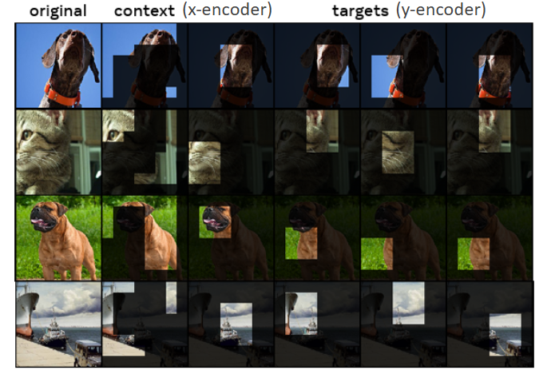

# Representation-Augmented Reinforcement Learning for Unified Navigation–Combat Agents in ViZDoom

> **Author**: Patrick Chen*, Nicholas Leone, Emanuel Mu˜noz Panduro  
> **Course**: 16-831 Robot Learning, Carnegie Mellon University  
> 📄 [View Project Final Report](./final_report/CMU_16831_Final_Project_Report.pdf)  
> 🖥️ [View Slide Presentation](https://docs.google.com/presentation/d/1iJui5_trFfHhKC4F9HJT7-ahU3H7S0OPiEGg95Aftp8/edit?usp=sharing)

## Contributions

- Built a modular PPO training/evaluation pipeline that **holds PPO fixed** while swapping only the **visual representation** (CNN vs. frozen DINOv2/v3 vs. JEPA-pretrained CNN), with optional **RND** exploration.
- Implemented **JEPA-style representation pretraining** on collected ViZDoom frame stacks, including **temporal JEPA** (`temporal_delta > 0`) with an **EMA target encoder** and masking-based prediction.
- Provided a reproducible evaluation toolkit: deterministic checkpoint evaluation (`eval_ppo_checkpoint`), TensorBoard aggregation/plotting utilities, and rollout GIF recorders for qualitative comparison.

This repository contains the code and experiment artifacts for a ViZDoom reinforcement learning study where we **hold PPO fixed** and vary only the **visual representation** (CNN vs. frozen foundation models vs. JEPA-pretrained CNN), optionally adding **Random Network Distillation (RND)** for intrinsic exploration. Evaluation uses **extrinsic reward only** and is tracked via TensorBoard scalar `Eval_AverageReturn`.



## Key Takeaways

- Frozen pretrained representations substantially improve **sample efficiency** in navigation-heavy environments (MyWayHome), reducing early “collapse”/local loops versus training a CNN encoder from scratch.
- RND helps weaker representations (e.g., PPO+CNN in MyWayHome) but can **slow down** strong frozen encoders (DINO / temporal JEPA).
- Temporal JEPA (larger `temporal_delta`) is consistently strong as a frozen backbone; light fine-tuning can further improve the alignment between visual representation and policy, thus enhance either speed or final return on the downstream task.

## Results

### BASIC: encoder ablations + optional RND (TensorBoard `Eval_AverageReturn`)



### BASIC: JEPA TD3 transfer variants (frozen vs. partial/full fine-tuning)



### MyWayHome: encoder ablations + optional RND (TensorBoard `Eval_AverageReturn`)



### MyWayHome: JEPA TD3 transfer variants (frozen vs. partial/full fine-tuning)


### Summary tables (from the final report)

Table 1 summarizes overall results across all agents. Higher is better for evaluation average return; lower is better for iterations to converge. Reported evaluation returns use **extrinsic reward only** (note the return ranges differ by task).



Table 2 compares JEPA_TD3 transfer protocols (frozen vs. partial unfreezing vs. full fine-tuning), all initialized from the same JEPA_TD3 pretrained encoder.



## Qualitative Results (GIFs)

These rollout GIFs are referenced in the final report.

- BASIC GIFs:
  - Random: [Google Drive Link (BASIC, Random)](https://drive.google.com/file/d/1TY_qVwCO8CvAnKOVXwrjXMVcuRLROdCb/view?usp=sharing)
  - PPO+CNN: [Google Drive Link (BASIC, PPO+CNN)](https://drive.google.com/file/d/16lZjdsa1pxSckNgRogNbXlLFkwsBagCl/view?usp=sharing)
  - PPO+DINOv3 (frozen): [Google Drive Link (BASIC, DINOv3)](https://drive.google.com/file/d/16-61gcBnK7YCywxWmaqbB0h_-r3HktMj/view?usp=sharing)
  - PPO+DINOv3+RND (frozen): [Google Drive Link (BASIC, DINOv3+RND)](https://drive.google.com/file/d/1rTiM6IHdG6tZp7r2LFHpE9oGa5TRIEJz/view?usp=sharing)
  - PPO+JEPA_TD3 (frozen): [Google Drive Link (BASIC, JEPA_TD3 frozen)](https://drive.google.com/file/d/1RQHuLO3wL6L0NrN48xMcByhGMSBufWzC/view?usp=sharing)
  - PPO+JEPA_TD3 (unfreeze 2): [Google Drive Link (BASIC, JEPA_TD3 unfreeze2)](https://drive.google.com/file/d/1Ebldp-UeMYoqWUY9HjdWUVahBOZoQY8D/view?usp=sharing)
  - PPO+JEPA_TD3 (full fine-tuning): [Google Drive Link (BASIC, JEPA_TD3 fullft)](https://drive.google.com/file/d/1blmY2r58SXCM5d2PNqWdWhDZhxgv6H3T/view?usp=sharing)

- MyWayHome GIFs:
  - Random: [Google Drive Link (MWH, Random)](https://drive.google.com/file/d/1WUCnLW8Xpnm5ypLLxLHv5xpYONXSqie6/view?usp=sharing)
  - PPO+CNN: [Google Drive Link (MWH, PPO+CNN)](https://drive.google.com/file/d/17-dtuzc1CHX0GUnoLA5j68Bcbq0BbN54/view?usp=sharing)
  - PPO+DINOv3 (frozen): [Google Drive Link (MWH, DINOv3)](https://drive.google.com/file/d/1w4Ge71smrFUC-aHTwmUvy0Xh8LR3Ryn6/view?usp=sharing)
  - PPO+DINOv3+RND (frozen): [Google Drive Link (MWH, DINOv3+RND)](https://drive.google.com/file/d/14hTZistmTK0Q9zvJfCGTBgi72-AFeUlU/view?usp=sharing)
  - PPO+JEPA_TD3 (frozen): [Google Drive Link (MWH, JEPA_TD3 frozen)](https://drive.google.com/file/d/1_iokleHknbz-LCYM02SglGN7VuUnlb4_/view?usp=sharing)
  - PPO+JEPA_TD3 (unfreeze 2): [Google Drive Link (MWH, JEPA_TD3 unfreeze2)](https://drive.google.com/file/d/1CG1ZIkQ9NvUMSt_GGFe0wi6kdW-3zGNi/view?usp=sharing)
  - PPO+JEPA_TD3 (full fine-tuning): [Google Drive Link (MWH, JEPA_TD3 fullft)](https://drive.google.com/file/d/1tNTdPGt7wzV5UQkNxEa19brfyQIBl0zP/view?usp=sharing)

## Visual Backbones Used

This project compares three backbone families:

- **CNN (trained end-to-end)**: lightweight 3-layer Conv encoder used by PPO.
- **DINOv2 / DINOv3 (frozen)**: large pretrained visual representations used as fixed feature extractors.
- **JEPA-CNN (pretrained, then frozen or fine-tuned)**: a Conv encoder pretrained via JEPA-style masked prediction with an EMA target network.



## JEPA Pretraining (EMA target + masking)

We pretrain a Conv encoder using a JEPA-style objective: a predictor maps the **context encoder** output to match the **EMA target encoder** output (stop-gradient). Masking is applied to the context input, while targets come from the unmasked input.

<div align="center">
  
</div>

Masking illustration (context vs. targets):



### Temporal JEPA

`temporal_delta > 0` switches JEPA into temporal mode: the model is trained to predict features of `x_{t+delta}` given a masked `x_t`. In this repository:

- `temporal_delta == 0`: single-frame JEPA (original)
- `temporal_delta > 0`: temporal JEPA (TD1/TD2/TD3 correspond to delta 1/2/3)

## Repository layout (high level)

- `env/`
  - `doom_env.py`: ViZDoom environment wrapper (frame stacking, resizing, action spaces, GIF helpers)
- `agents/`
  - `ppo_agent.py`: PPO actor-critic and backbone selection
  - `random_agent.py`: random baseline agent
  - `jepa_model.py`: JEPAConfig / JEPAModel (EMA target, masking, variance/covariance regularizers)
  - `nn_actor_critic.py`: CNN-based actor–critic backbone (lightweight Conv encoder + policy/value heads) used by PPO when backbone="cnn"
  - `nn_actor_critic_dinov2.py`: DINOv2-based actor–critic (wraps a frozen or partially trainable DINOv2 feature extractor, then policy/value heads).
  - `nn_actor_critic_dinov3.py`: DINOv3-based actor–critic (wraps a frozen or partially trainable DINOv3 feature extractor, then policy/value heads).
- `train/`
  - `rl_trainer.py`: main training loop (collect → update → eval, TensorBoard logging, checkpoints)
  - `replay_buffer.py`: On-policy rollout buffer for PPO—stores the current iteration’s transitions (obs/actions/rewards/dones/values/log_probs) and computes GAE advantages + returns; it is reset each iteration (not an off-policy replay buffer).
- `dataset/`
  - `jepa_frames_dataset.py`: `JEPAFramesDataset` / `JEPAFramesTemporalDataset` for `.npy` frame stacks
- `eval/`
  - `evaluation.py`: evaluation loop + `EvalLogger` + plotting `.npz` curves
  - `plot_tb_avg_return.py`: overlay multiple TensorBoard runs for a scalar (default `Eval_AverageReturn`)
- `scripts/`
  - `collect_jepa_frames.py`: collect rollouts for JEPA pretraining usage
  - `pretrain_jepa.py`: JEPA pretraining entry point (supports temporal JEPA via `--temporal_delta`)
  - `train_ppo_basic.py`: PPO training/eval loop (logs TensorBoard + eval `.npz`) entry point
  - `train_random_basic.py`: random baseline training/eval loop (logs TensorBoard + eval `.npz`) entry point
  - `eval_random_play.py`: run a random policy and optionally record GIFs
  - `eval_ppo_basic_play.py`: run a PPO checkpoint and record GIFs
  - `eval_ppo_checkpoint.py`: deterministic evaluation of a PPO checkpoint to `.npz`
  - `plot_tb_*.sh`: convenience scripts to reproduce the figures in the report

## Setup

### Dependencies

At minimum you need:

- Python 3.10+
- PyTorch
- ViZDoom
- NumPy, tqdm
- TensorBoard (`tensorboard`)
- Matplotlib (for plots)
- Pillow + imageio (for GIF export)

Optional:

- Weights & Biases (`wandb`) for JEPA pretraining logging (`--use_wandb`)

A typical installation pattern:

```bash
pip install torch torchvision torchaudio
pip install vizdoom numpy tqdm tensorboard matplotlib pillow imageio
# optional
pip install wandb
```

If you use Hugging Face-based backbones, set a cache directory (as in provided scripts):

```bash
export HF_HOME=/data/hf_cache
```

## Running experiments

### 1) Random baseline (training loop for logging/eval)

The random baseline uses `RLTrainer` but routes actions through `RandomAgent`:

```bash
python -m scripts.train_random_basic \
  --scenario basic \
  --action_space usual
```

```bash
python -m scripts.train_random_basic \
  --scenario my_way_home \
  --action_space no_shoot \
  --total_iterations 20 \
  --steps_per_iteration 4096 \
  --log_root ./logs_mwh \
  --plot_root ./plots_mwh \
  --tb_dirname tb_run1 \
  --eval_log_name mwh_random_run1_eval.npz \
  --checkpoint_root ./checkpoints_mwh \
  --checkpoint_name mwh_random_run1 \
  --save_every 5
```

### 2) JEPA pretraining on collected frames

Collect rollouts for JEPA pretraining.
If you do not give the trained checkpoint from any other agents, the actor will just acting randomly through the rollout collection.

```bash
python -m scripts.collect_jepa_frames \
  --scenario basic \
  --action_space usual \
  --frame_repeat 4 \
  --frame_stack 4 \
  --width 84 \
  --height 84 \
  --base_res 320x240 \
  --seed 0 \
  --num_steps 50000 \
  --trained_ckpt "" \
  --trained_rollout_prob 0.0 \
  --max_episode_steps 300 \
  --out_path /data/16831RL/jepa_rollout_colllect/jepa_frames_basic_random_50k.npy
```

If you do give the trained checkpoint, then the actor will act just like the trained agent like an expert.

```bash
python -m scripts.collect_jepa_frames \
  --scenario basic \
  --action_space usual \
  --frame_repeat 4 \
  --frame_stack 4 \
  --width 84 \
  --height 84 \
  --base_res 320x240 \
  --seed 1 \
  --num_steps 50000 \
  --trained_ckpt /data/16831RL/checkpoints/basic_ppo_final.pt \
  --trained_rollout_prob 1.0 \
  --max_episode_steps 300 \
  --out_path /data/16831RL/jepa_rollout_colllect/jepa_frames_basic_expert_50k.npy
```

The followings are an example in MyWayHome environment.

```bash
python -m scripts.collect_jepa_frames \
  --scenario my_way_home \
  --action_space no_shoot \
  --frame_repeat 4 \
  --frame_stack 4 \
  --width 84 \
  --height 84 \
  --base_res 320x240 \
  --seed 0 \
  --num_steps 100000 \
  --trained_ckpt "" \
  --trained_rollout_prob 0.0 \
  --max_episode_steps 16384 \
  --out_path /data/16831RL/jepa_rollout_colllect/jepa_frames_mwh_random_100k.npy
```

```bash
python -m scripts.collect_jepa_frames \
  --scenario my_way_home \
  --action_space no_shoot \
  --frame_repeat 4 \
  --frame_stack 4 \
  --width 84 \
  --height 84 \
  --base_res 320x240 \
  --seed 1 \
  --num_steps 100000 \
  --trained_ckpt /data/16831RL/checkpoints/mwh_ppo_rnd_final.pt \
  --trained_rollout_prob 1.0 \
  --max_episode_steps 16384 \
  --out_path /data/16831RL/jepa_rollout_colllect/jepa_frames_mwh_expert_100k.npy
```

`pretrain_jepa.py` expects one or more rollouts `.npy` files with shape `(N, C, H, W)` where `C = frame_stack * 3` (e.g., 12 for 4-frame stacking).

Single-frame JEPA:

```bash
python -m scripts.pretrain_jepa \
  --frames_paths \
    /data/16831RL/jepa_rollout_colllect/jepa_frames_basic_random_50k.npy \
    /data/16831RL/jepa_rollout_colllect/jepa_frames_basic_expert_50k.npy \
  --out_ckpt /data/16831RL/checkpoints/basic_cnn_jepa_coswarm_e150_wmup0p1_td0_varw2_std1_nmb5_mask_0p6.pt \
  --in_channels 12 \
  --feat_dim 256 \
  --batch_size 128 \
  --epochs 150 \
  --lr 1e-3 \
  --min_lr 1e-5 \
  --warmup_ratio 0.10 \
  --mask_ratio 0.6 \
  --temporal_delta 0 \
  --var_weight 2.0 \
  --covar_weight 1.0 \
  --std_target 1.0 \
  --momentum 0.996 \
  --device cuda \
  --num_workers 4 \
  --use_wandb \
  --wandb_project vizdoom-jepa \
  --wandb_run_name basic_cnn_jepa_coswarm_e150_wmup0p1_td0_varw2_std1_nmb5_mask_0p6
```

Temporal JEPA pretraining in BASIC environment (example: TD3):

```bash
python -m scripts.pretrain_jepa \
  --frames_paths \
    /data/16831RL/jepa_rollout_colllect/jepa_frames_basic_random_50k.npy \
    /data/16831RL/jepa_rollout_colllect/jepa_frames_basic_expert_50k.npy \
  --out_ckpt /data/16831RL/checkpoints/basic_cnn_jepa_coswarm_e150_lr1en3_wmup0p1_nmb5_varw2_covw1_std1_mask0p6_td3.pt \
  --in_channels 12 \
  --feat_dim 256 \
  --batch_size 128 \
  --epochs 150 \
  --lr 1e-3 \
  --min_lr 1e-5 \
  --warmup_ratio 0.1 \
  --mask_ratio 0.6 \
  --temporal_delta 3 \
  --num_blocks 5 \
  --var_weight 2.0 \
  --std_target 1.0 \
  --covar_weight 1.0 \
  --momentum 0.996 \
  --device cuda \
  --num_workers 4 \
  --use_wandb \
  --wandb_project vizdoom-jepa \
  --wandb_run_name basic_cnn_jepa_coswarm_e150_lr1en3_wmup0p1_nmb5_varw2_covw1_std1_mask0p6_td3
```

Temporal JEPA pretraining in MyWayHome environment (example: TD3):

```bash
python -m scripts.pretrain_jepa \
  --frames_paths \
    /data/16831RL/jepa_rollout_colllect/jepa_frames_mwh_random_100k.npy \
    /data/16831RL/jepa_rollout_colllect/jepa_frames_mwh_expert_100k.npy \
  --out_ckpt /data/16831RL/checkpoints/mwh_cnn_jepa_coswarm_e150_lr1en3_wmup0p1_nmb5_varw2_std1_covw1_mask0p6_td3.pt \
  --in_channels 12 \
  --feat_dim 256 \
  --batch_size 128 \
  --epochs 150 \
  --lr 1e-3 \
  --min_lr 1e-5 \
  --warmup_ratio 0.1 \
  --mask_ratio 0.6 \
  --temporal_delta 3 \
  --num_blocks 5 \
  --var_weight 2.0 \
  --std_target 1.0 \
  --covar_weight 1.0 \
  --momentum 0.996 \
  --device cuda \
  --num_workers 4 \
  --use_wandb \
  --wandb_project vizdoom-jepa-mwh \
  --wandb_run_name mwh_cnn_jepa_coswarm_e150_lr1en3_wmup0p1_nmb5_varw2_std1_covw1_mask0p6_td3
```

Notes:
- JEPA supports optional W&B logging via `--use_wandb`.
- EMA momentum is controlled by `--momentum` (default `0.99`).

### 3) PPO training (encoder ablations)

PPO training is driven by `RLTrainer` + `PPOAgent` with different `backbone` settings:
- `cnn` (trainable),
- `dinov2` / `dinov3` (typically frozen),
- `jepa_*` variants (pretrained weights, frozen or partially unfrozen depending on your config).

PPO training using frozen pretrained JEPA TD3 in BASIC environment for example:

```bash
python -m scripts.train_ppo_basic \
  --scenario basic \
  --action_space usual \
  --total_iterations 200 \
  --steps_per_iteration 8192 \
  --batch_size 128 \
  --learning_rate 1e-4 \
  --clip_coef 0.1 \
  --value_coef 0.25 \
  --entropy_coef 0.01 \
  --eval_deterministic \
  --eval_episodes 10 \
  --eval_interval 1 \
  --eval_log_dir /data/16831RL/logs \
  --eval_log_name basic_ppo_jepa_td3_frozen_eval.npz \
  --tb_log_dir /data/16831RL/logs/tb_basic_ppo_jepa_td3_frozen \
  --checkpoint_dir /data/16831RL/checkpoints \
  --checkpoint_name basic_ppo_jepa_td3_frozen \
  --save_every 80 \
  --jepa_ckpt /data/16831RL/checkpoints/basic_cnn_jepa_coswarm_e150_lr1en3_wmup0p1_nmb5_varw2_covw1_std1_mask0p6_td3.pt \
  --freeze_backbone \
  --jepa_partial_unfreeze 0
```

PPO training using frozen pretrained JEPA TD3 in MyWayHome environment for example:

```bash
python -m scripts.train_ppo_basic \
  --scenario my_way_home \
  --action_space no_shoot \
  --total_iterations 200 \
  --steps_per_iteration 16384 \
  --batch_size 256 \
  --learning_rate 3e-4 \
  --clip_coef 0.2 \
  --value_coef 0.5 \
  --entropy_coef 0.01 \
  --eval_episodes 10 \
  --eval_interval 1 \
  --eval_log_dir /data/16831RL/logs \
  --eval_log_name mwh_ppo_jepa_td3_frozen.npz \
  --tb_log_dir /data/16831RL/logs/tb_mwh_ppo_jepa_td3_frozen \
  --checkpoint_dir /data/16831RL/checkpoints_mwh \
  --checkpoint_name mwh_ppo_jepa_td3_frozen \
  --save_every 80 \
  --jepa_ckpt /data/16831RL/checkpoints/mwh_cnn_jepa_coswarm_e150_lr1en3_wmup0p1_nmb5_varw2_std1_covw1_mask0p6_td3.pt \
  --freeze_backbone \
  --jepa_partial_unfreeze 0
```

Refer to `scripts/train_ppo_basic.py` for the full set of flags. The plots in the report were generated from TensorBoard directories such as:

- `logs/tb_basic_ppo`
- `logs/tb_basic_ppo_dinov2_run2`
- `logs/tb_basic_ppo_jepa_td3_frozen`
- `logs/tb_mwh_ppo_v2`
- …

## Evaluation & visualization

### A) Plot TensorBoard `Eval_AverageReturn` across multiple runs

Generic overlay tool:

```bash
python -m eval.plot_tb_avg_return \
  --logdirs /path/to/tb_run1 /path/to/tb_run2 \
  --tag Eval_AverageReturn \
  --output ./plots/avg_return_comparison.png
```

Convenience scripts (used for report figures):

```bash
bash scripts/plot_tb_basic_avg_return.sh
bash scripts/plot_tb_basic_td3_frozen_trans_return.sh
bash scripts/plot_tb_mwh_avg_return.sh
bash scripts/plot_tb_mwh_td3frozen_return.sh
```

### B) Deterministic evaluation of a PPO checkpoint (no training)

Run `agent.act(..., deterministic=True)` for `N` episodes and save a `.npz` compatible with `eval/evaluation.py`:

```bash
python -m scripts.eval_ppo_checkpoint \
  --scenario basic \
  --action_space usual \
  --checkpoint /path/to/checkpoint.pt \
  --eval_log_path ./logs/ppo_eval_det.npz \
  --episodes 50 \
  --backbone cnn \
  --feat_dim 256
```

Plot the saved `.npz`:

```bash
python -m eval.evaluation \
  --log_path ./logs/ppo_eval_det.npz \
  --out ./plots/ppo_eval_det.png
```

### C) Record GIF rollouts

Random policy:

```bash
python -m scripts.eval_random_play \
  --scenario basic \
  --action_space usual \
  --episodes 5 \
  --frame_repeat 4 \
  --frame_stack 4 \
  --width 84 --height 84 \
  --base_res 800x600 \
  --gif ./out/basic_random_v8/best.gif \
  --gif_dir ./out/basic_random_v8/eps \
  --fps 12 \
  --gif_scale 1 \
  --gif_repeat 1 \
  --seed 47
```

```bash
python -m scripts.eval_random_play \
  --scenario my_way_home \
  --action_space no_shoot \
  --episodes 5 \
  --max_gif_frames 800 \
  --frame_repeat 4 \
  --frame_stack 4 \
  --width 84 --height 84 \
  --base_res 800x600 \
  --gif ./out/mwh_random_v5/best.gif \
  --gif_dir ./out/mwh_random_v5/eps \
  --fps 15 \
  --gif_scale 1 \
  --gif_repeat 1 \
  --seed 0
```

PPO checkpoint:

```bash
python -m scripts.eval_ppo_basic_play \
  --checkpoint /data/16831RL/checkpoints/basic_ppo_jepa_td3_frozen_final.pt \
  --scenario basic \
  --action_space usual \
  --backbone cnn \
  --freeze_backbone \
  --episodes 5 \
  --frame_repeat 4 \
  --frame_stack 4 \
  --width 84 --height 84 \
  --base_res 800x600 \
  --gif ./out/basic_ppo_jepa_td3_frozen/best.gif \
  --gif_dir ./out/basic_ppo_jepa_td3_frozen/eps \
  --fps 15 \
  --gif_scale 1 \
  --gif_repeat 1 \
  --deterministic
```

```bash
python -m scripts.eval_ppo_basic_play \
  --checkpoint /data/16831RL/checkpoints_mwh/mwh_ppo_jepa_td3_frozen_final.pt \
  --scenario my_way_home \
  --action_space no_shoot \
  --backbone cnn \
  --freeze_backbone \
  --episodes 5 \
  --frame_repeat 4 \
  --frame_stack 4 \
  --width 84 --height 84 \
  --base_res 800x600 \
  --gif ./out/mwh_ppo_jepa_td3_frozen/best.gif \
  --gif_dir ./out/mwh_ppo_jepa_td3_frozen/eps \
  --fps 15 \
  --gif_scale 1 \
  --gif_repeat 1 \
  --deterministic
```

## Notes on observation shapes and preprocessing

- `DoomEnv.reset()` returns stacked observations as a NumPy array with shape `(T, 3, H, W)` where `T = frame_stack`.
- Utilities in `eval/evaluation.py` convert this to a PyTorch tensor `(1, 3T, H, W)` in `[0, 1]`:
  - `stacked_obs_to_tensor(obs, device)`

## Assets

The README embeds the report figures under `final_report/images/`. Expected files:

- `final_report/images/method_overview.png`
- `final_report/images/jepa_block_diagram.png`
- `final_report/images/jepa_masking_illustration.png`
- `final_report/images/dinnov2_v3.png`
- `final_report/images/basic_eval_avg_return.png`
- `final_report/images/basic_eval_td3frozen_trans_return.png`
- `final_report/images/mwh_eval_avg_return.png`
- `final_report/images/mwh_eval_td3frozen_trans_return.png`
- `final_report/images/table1_overall_results.png`
- `final_report/images/table2_jepa_td3_transfer.png`

## Acknowledgements

- ViZDoom environment by the ViZDoom authors.
- PPO implementation adapted to the course project setting.
- DINO backbones are used as frozen feature extractors for transfer experiments.
